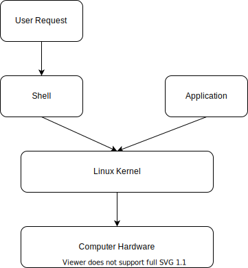

# 29 Aug 2022 <!-- omit in toc -->

---

# Contents <!-- omit in toc -->

- [Shell Introduction](#shell-introduction)
  - [Types of Shell](#types-of-shell)
  - [Workflow](#workflow)

---

## Shell Introduction

- Shell is interface between user command and OS
- English command to binary conversion

### Types of Shell

- Bond Shell
- Bash Shell
- TCSH Shell
- etc.

- Graphical => ex. Opening a window through explorer
- Command Line => ex. Opening a window through cmd line

### Workflow

